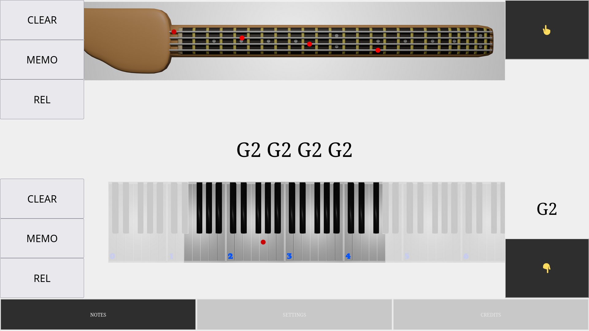
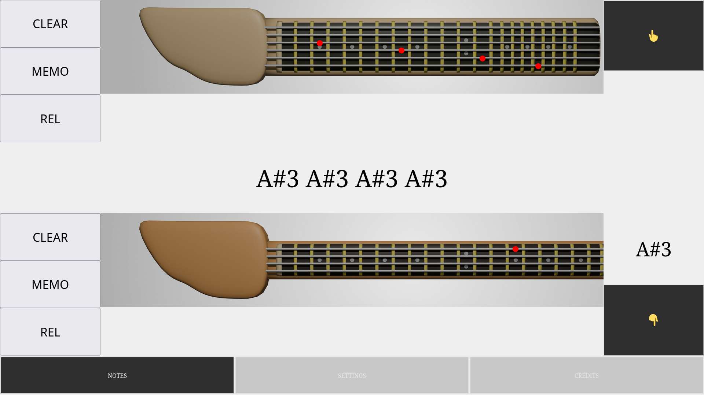

# FopenP Instrument Tool

Instrument Tool is basically a bass/guitar/keyboard note finder.

After you have selected a note in the keyboard, you can press the 👆 button to make appear the note in the bass.

If you select a note (or a chord) in the bass and press the 👇 button, the keyboard will show the note or the chord.

In the Settings panel you can select the instruments. Click on the "Settings" center button in the lower part of the screen.

This is a PWA (progressive web app) and, in your smartphone, you can install an icon and use this app even when you are offline. In this case, you must visit the following link:

[https://fopenp.github.io/instrument-tool-pwa/](https://fopenp.github.io/instrument-tool-pwa/)

and, in the browser's menu, select "Add to home screen".

If you want to remove the icon, you can drag the icon to the bin or to the "Remove" text.

